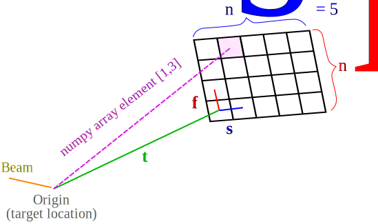

.. _doc_detectors:

Detectors
=========

.. _doc_pads:

Pixel-Array Detectors
---------------------

    Schematic of a Pixel-Array Detector.

The |PADGeometry| class contains the data and methods needed to deal
with "pixel-array detectors" (PADs).  This detector is assumed to consist of a regular 2D grid of
pixels.  We specify the locations of detector pixels with respect to an arbitrary origin that is also
the origin of the coordinates of the object that creates the diffraction pattern.  The 2D grid of pixels is described by
the following parameters:

* :math:`\vec{t}` is the vector that points from the origin to the *center* of the first pixel in memory.
* :math:`\vec{f}` is the vector that points from the first pixel in memory to the next pixel in the fast-scan direction.
* :math:`\vec{s}` The vector that points from the first pixel in memory, to the next pixel in the slow-scan direction.
* :math:`n_f` is the number of pixels along the fast-scan direction.
* :math:`n_s` is the number of pixels along the slow-scan direction.

In the above:

* The :math:`\vec{f}` and :math:`\vec{s}` vectors form the *basis* of the 2D grid of pixels.  These vectors also set the
  pixel size.  Note that pixels need not be square.
* The term "fast-scan" corresponds to the right-most index of an |ndarray| containing PAD data.
* The term "slow-scan" corresponds to the left-most index of an |ndarray| containing PAD data.
* In the default memory buffer layout of an |ndarray|, the fast-scan direction corresponds to pixels that are
  contiguous in memory, and which therefore have the smallest stride.  If the phrase "contiguous in memory" and the
  term "stride" does not mean anything to you, then you need to read the |numpy| documentation for |ndarray|.

.. note::

    In December 2021, we added the capability of a |PADGeometry| instance to contain information about how the data
    corresponding to a given PAD may be |sliced| from a parent |ndarray|.  You may optionally define the following
    parameters:

    * ``parent_shape`` : The expected shape of the parent |ndarray|.
    * ``parent_slice`` : The |slice| object needed to extract or insert this PAD's data into the parent |ndarray|.

.. note::

    The reborn package never uses angles to describe detector geometry.  Angles are a truly awful specification due to
    the many different conventions used by different literature and software, and, as all good students know, *rotation
    operations do not commute*.

Additional vectors that are important for calculating things related to x-ray scattering, but which are not inherently
related to detector geometry, are:

:math:`\hat{b}` is the incident beam vector that describes the nominal direction of the x-ray beam.

:math:`\hat{e}_1` is the direction of the principle electric field vector, which would be the direction of the electric
field in the case of linearly polarized x-rays.  The second vector that is needed for unpolarized or elliptically
polarized x-rays is always :math:`\hat{e}_2 = \hat{b}\times\hat{e}_1` .

With the above vectors specified, we may now generate the quantities that will be useful when doing diffraction analysis
and simulations.  Central to many calculations is the vector pointing from the origin (where the target is located) to a
detector pixel indexed by :math:`i` and :math:`j`, is

.. math::

    \vec{v}_{ij}=\vec{t}+i\vec{f}+j\vec{s}

Note that the above associates the :math:`i` index with the fast scan.  Therefore, the correct way to access this
element in a numpy array is `data[j, i]`, because the right-most index is the fast-scan index (for an |ndarray| that
is in the default "c-contiguous" layout).

Now let's compute the scattering vector for pixel :math:`i,j`:

.. math::

    \vec{q}_{ij}=\frac{2\pi}{\lambda}\left(\hat{v}_{ij} - \hat{b}\right)

where :math:`\lambda` is the photon wavelength.  Next we can compute the scattering angle of a pixel:

.. math::

    \theta_{ij} = \arccos(\hat{v}_{ij}\cdot\hat{b})

For linearly polarized light, the polarization correction is

.. math::

    P_{ij} = 1 - |\hat{e}_1\cdot\hat{v}_{ij}|^2

If the light is not linearly polarized, then the polarization factor is a weighted sum of the above component and this
one:

.. math::

    P'_{ij} = 1 - |(\hat{b}\times\hat{e}_1)\cdot\hat{v}_{ij}|^2

The solid angle of a pixel is approximately equal to

.. math::

    \Delta \Omega_{ij} \approx \frac{\text{Area}}{R^2}\cos(\theta) = \frac{|\vec{f}\times\vec{s}|}{|v|^2}\hat{n}\cdot \hat{v}_{ij}`

where the vector normal to the PAD is

.. math::

    \hat{n} = \frac{\vec{f}\times\vec{s}}{|\vec{f}\times\vec{s}|}

The |PADGeometry| class can currently generate the above quantities for you, along with other helpful functions.  The
|PADGeometryList| class combines multiple |PADGeometry| instances.

.. note::

    Once the above is understood, you might want to look at the :ref:`example <example_pad_geometry>` of how to use the
    PAD geometry tools provided by reborn.

Data and geometry formats
-------------------------

A central task in diffraction analysis is the assignment of physical locations (3D vectors) to each detector pixel.
Actually, our task is two-fold:

1) Transform the data found on disk or in memory to numpy arrays.
2) Determine the 3D positions corresponding to the elements of the numpy arrays.

The :class:`PADGeometry <reborn.detector.PADGeometry>` class contains the needed information to perform step (2), but
does not have any involvement in step (1).  Step (1) is often a messy process that requires specialized code, and
we have made no effort to standardize that process.  However, once you have a
:class:`PADGeometry <reborn.detector.PADGeometry>` instance along with corresponding numpy arrays, your analysis code
can hopefully be written in a source-agnostic way.

Since XFELs tend to use multiple PADs, you should plan to work with lists of
:class:`PADGeometry <reborn.detector.PADGeometry>` instances rather than a single one. You can still do vectorized
operations on all panels at once with the numpy ravel function.

Working with CrystFEL geometry files
------------------------------------

The following is relevant if you need to work with a CrystFEL ".geom" file.  They are ubiquitous in SFX work, and
thus we have a bit of code included in reborn for handling them.

Firstly, you need to read about the CrystFEL `geom <http://www.desy.de/~twhite/crystfel/manual-crystfel_geometry.html>`_ 
file specification.  Note that CrystFEL geom files contain a lot more than geometry information.  They also contain
information about...

* detector properties (e.g. saturation levels, common-mode noise and conversions between digital data units and
  deposited x-ray energy),
* information about how to obtain encoder values that specify detector positions,
* formatting of the files that contain the diffraction data,
* how programs like indexamajig should treat the data (e.g. the no_index card)

If you want to read in the complete information from a geom file you can convert it to a python dictionary using the
:func:`load_crystfel_geometry() <reborn.external.crystfel.load_crystfel_geometry>` function, which is just a wrapper
for the corresponding function in the `cfelpyutils <https://pypi.org/project/cfelpyutils/>`_ package.  Be careful:
the units here might not be the same as assumed in reborn code.

Most importantly, geom files contain the three principal vectors that reborn utilizes, although it may not be obvious
at first glance.  If you just want this information, then you can simply use a geom file to generate a list of
:class:`PADGeometry <reborn.detector.PADGeometry>` instances via the
:func:`geometry_file_to_pad_geometry_list() <reborn.external.crystfel.geometry_file_to_pad_geometry_list>` function.  If
you use this function, you do not need to worry about units since they are in the standard reborn units (SI).

A note on detector "geometry complications"
-------------------------------------------

There is much to say about the complications that arise in analyzing PAD data.  One of the first points of confusion
is due to the entanglement of detector geometry with detector data formats.  Some programs re-format the raw data
found on disk and then re-write to an intermediate file format that is used later in the analysis pipeline.  This is
what occurs, for example, when the program `Cheetah <http://www.desy.de/~barty/cheetah/Cheetah/Welcome.html>`_ reads
data from an XTC file [1] created at the LCLS; Cheetah immediately re-formats the data internally and then writes
processed data in a specialized variant of the CXIDB file format [2].
In the case of CSPAD detector data from LCLS, the data are re-written by Cheetah in a way that the
detector PADs are no longer contiguous in memory, which is sometimes nice for the purpose of viewing raw data, but it
leads many people to the following puzzle: given a CrystFEL geom file that refers to the data layout in a
Cheetah-formatted CXIDB file, how does one map that geometry to the original raw XTC data format presented in the LCLS
software psana?  Often times, this puzzle may be avoided by maintaining data in the original layout.  There are a couple
of utilities that may be helpful in :mod:`reborn.external`.

Footnotes
---------

[1] I have not been able to find documentation of the XTC file format in the
`LCLS Data Analysis <https://confluence.slac.stanford.edu/display/PSDM/LCLS+Data+Analysis>`_ documentation, but there
are some "recipies" for accessing this data with Python that are helpful, and the LCLS staff are *extremely* helpful
in this regard so you should email them with questions!

[2] CXIDB files do indeed have
have `documentation <https://www.cxidb.org/>`_), but so far it does not appear that the specification is enforced
strictly by anyone.  Reading a CXIDB file is not as deterministic as, for example, reading a
`PDB file <https://www.rcsb.org/pdb/static.do?p=file_formats/pdb/index.html>`_.