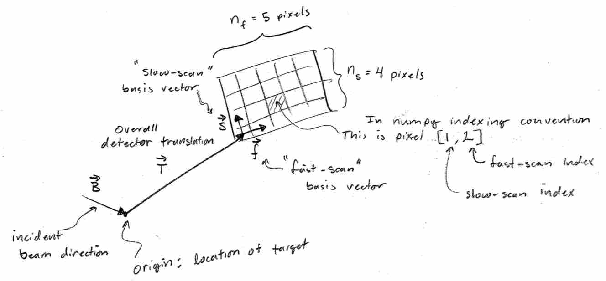

Overview
========

Some day this page will have sufficient information to get you started with bornagain.

Some basics
-----------

- All units in bornagain are SI.  Angles are radians.  There are no known exceptions so far.
- Refrain from using the terms "rows" and "columns" when speaking of images.  Unless you are referring to a specific display, those terms are confusing.
- Also refrain from refering "x", "y", or "z" coordinates.  There is no standard coordinate system in the diffraction world, and the bornagain makes no attempt to create one.
- We generally assume the numpy default that all arrays are `c-contiguous in memory <https://docs.scipy.org/doc/numpy-1.13.0/reference/internals.html>`_.  One consequence of this is that arrays of vectors are assumed to have a shape of (N,3) so that vector elements are neighbors in memory.  Similarly, we always assume that the right-most index of a 2D image is the one that specifies data that are closest in memory.
- You can't make good use of bornagain without learning the basics of Python, including the basics of object-oriented programming.
- The `tab-completion feature in iPython <https://ipython.org/>`_ is one of the most efficient ways to explore the functionality of bornagain classes.
- If documentation is missing or confusing, please fix it or tell someone (e.g. rkirian at asu dot edu).

X-ray beams
-----------

The bornagain package provides the :any:`Beam` class for describing x-ray beams.  So far it is a lightweight and minimalistic description of an x-ray beam.  The first couple of parameters that are needed to describe a beam are:

    :math:`\lambda`, the "nominal" wavelength of the beam

and

    :math:`\hat{B}`, the unit vector pointing along the "nominal" incident beam direction.

Wavelength might be accompanied by a FWHM spread in photon energy :math:`\Delta E/E`, and the nominal beam direction might be accompanied by the beam divergence FWHM.  The bornagain package does not make a general assumption about the beam direction, but the [0,0,1] direction is most commonly used so far.

Beam polarization can also be important:

    :math:`\hat{U}` is the polarization vector for the x-ray beam.

This single vector is appropriate for linearly polarized beams.  For beams that are not purely linearly polarized, one can sum the contributions from each of the two polarizations.  The second polarization vector is of course :math:`\hat{U}\times\hat{B}` .

Most of the above parameters can be specified by an instance of the :any:`Beam` class.  Derived quantities such as the polarization correction are tied to classes contained in the :any:`detector` module.

Pixel-Array Detectors
---------------------

   Schematic of a Pixel-Array Detector.

The most common detector we use is the "pixel-array detector", abbeviated as "PAD" in the bornagain package.  This detector is like a CCD and is assumed to consist of an orthogonal 2D grid of pixels.  This grid is described by the following vectors:

    :math:`\vec{T}` is the vector pointing from the origin to the center of the corner detector pixel that is assumed to be the first in memory.

    :math:`\vec{F}` is the vector that points along the "fast-scan" direction.  This is the distance and direction that points to the next pixel that is adjacent in physical space, as well as in computer memory.  The length of this vector indicates the pixel size.
    
    :math:`N_F` is the number of fast-scan pixels in the detector.
    
    :math:`\vec{S}` is the vector that points along the "slow-scan" direction.  This is much like the :math:`\vec{F}` vector, but these pixels are only adjacent in physical space but not in computer memory.  In computer memory, adjacent pixels have a memory stride of length :math:`N_F`.
    
    :math:`N_S` is the number of slow-scan pixels in the detector.

Note that there are no angles involved in describing the detector geometry.  That is because angles are confusing due to the many different conventions used by different reference books and software.  Also, importantly, rotation operations do not commute, which only adds to the confusion.

With the above vectors specified, we may now generate the quantities that will be useful when doing diffraction analysis and simulations.  The vector pointing from the origin (where the target is located) to a detector pixel indexed by :math:`i` and :math:`j`, is 

    :math:`\vec{V}_{ij}=\vec{T}+i\vec{F}+j\vec{S}`

Easy, right?  Now let's compute the scattering vector for pixel :math:`i,j`:

    :math:`\vec{Q}_{ij}=\frac{2\pi}{\lambda}\left(\hat{V}_{ij} - \hat{B}\right)`

where :math:`\lambda` is the photon wavelength.  Next we can compute the scattering angle of a pixel:

    :math:`\theta_{ij} = \arccos(\hat{V}_{ij}\cdot\hat{B})`

For linearly polarized light, the polarization correction is

    :math:`P_{ij} = 1 - |\hat{U}\cdot\hat{V}_{ij}|^2`

If the light is not linearly polarized, then the polarization factor is a weighted sum of the above component and this one:

    :math:`P'_{ij} = 1 - |(\hat{B}\times\hat{U})\cdot\hat{V}_{ij}|^2`

The solid angle of a pixel is approximately equal to 

    :math:`\Delta \Omega_{ij} \approx \frac{\text{Area}}{R^2}\cos(\theta) = \frac{|\vec{F}\times\vec{S}|}{|V|^2}\hat{n}\cdot \hat{V}_{ij}`

where the vector normal to the PAD is 

    :math:`\hat{n} = \frac{\vec{F}\times\vec{S}}{|\vec{F}\times\vec{S}|}`

In the bornagain detector and source modules, you will find a reasonably good correspondence between the quantities above and the members of the classes within the :any:`detector` and :any:`source` modules.  

Simulation
----------

Some description of how we work with opencl.