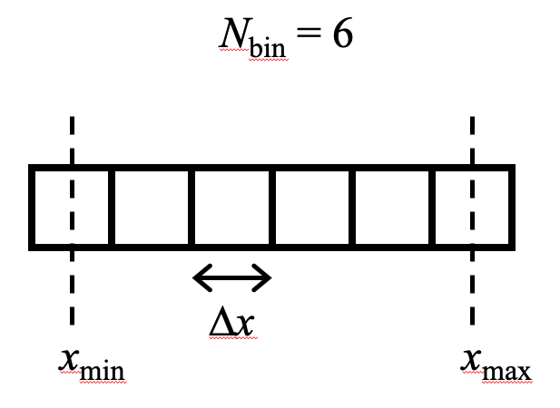

Sampling and Binning
====================

Definition
----------

    Schematic of a 1D discretisation with 6 bins.

One convention is to specify the positions of the min and max bins, :math:`x_{\mathrm{min}}`, :math:`x_{\mathrm{max}}`, and the number of bins in between, :math:`N_{\mathrm{bin}}`. The positions are definied to be the center of the bins.

The width of each bin is

    :math:`\Delta x = \frac{x_{\mathrm{max}} - x_{\mathrm{min}}}{N_{\mathrm{bin}} - 1}`

The position for the :math:`n` th bin is

    :math:`x_n = x_{\mathrm{min}} + n \Delta x`

where the bin indices range from :math:`n = 0, \cdots, N_{\mathrm{bin}}-1`

The bin index :math:`n_{\mathrm{s}}` for a sample at position :math:`x_{\mathrm{s}}` can be calculated via

    :math:`n_{\mathrm{s}} = \mathrm{floor} \left( \frac{x_{\mathrm{s}} - (x_{\mathrm{min}} - \Delta x / 2)}{\Delta x} \right)`

The sanity checks are (1) If :math:`x_{\mathrm{s}} = x_{\mathrm{min}} - \Delta x /2` the index should be zero. (2) If :math:`x_{\mathrm{s}} = x_{\mathrm{min}} + \Delta x /2` the index should be one.

Handling multi-dimensional arrays
---------------------------------

When we specify the bins for multi-dimensional arrays, we provide tuples of :math:`x_{\mathrm{min}}`,
:math:`x_{\mathrm{max}}`, and :math:`N_{\mathrm{bin}}`.  Importantly the tuples should
correspond to the shapes of numpy arrays; the *first* element (index 0) corresponds to the dimension with
*largest* stride between array elements.  Google search "numpy stride" if you do not understand this.
